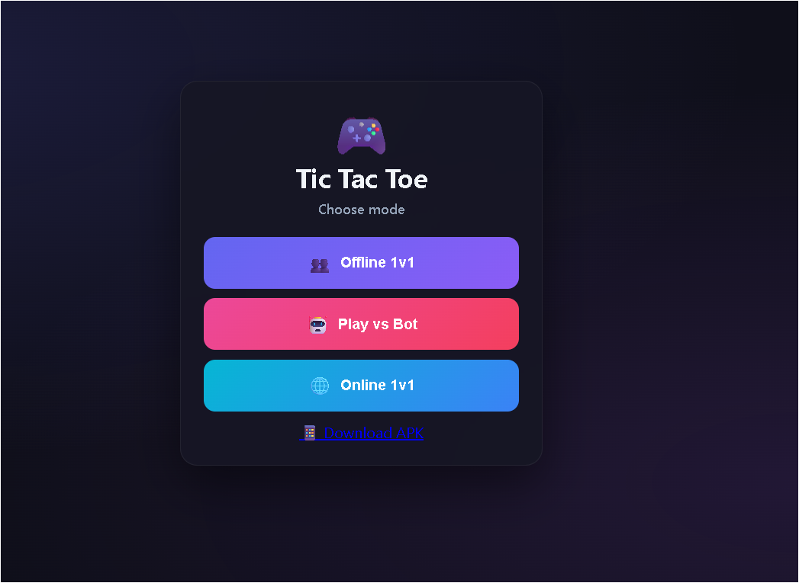

# 🎮 Tic-Tac-Toe Master

<p align="center">
  
  
  
  
</p>

<p align="center">
  <strong>A modern Tic-Tac-Toe game with AI opponents, local multiplayer, and online 1v1 multiplayer.</strong>
</p>

<p align="center">
  Play against friends, challenge the AI, or create an online room and play from anywhere.
</p>

<p align="center">
  <a href="https://tarunshukla11.github.io/Tic-Tac-Toe-Master/">
    
  </a>
  <a href="https://github.com/tarunshukla11/Tic-Tac-Toe-Master/releases">
    
  </a>
</p>

---

## 📸 Preview

<p align="center">
  
</p>


---

## ✨ What is Tic-Tac-Toe Master?

**Tic-Tac-Toe Master** is a modern implementation of the classic Tic-Tac-Toe game built with **HTML, CSS, and JavaScript**.

Instead of being limited to a basic local board, the project includes:

* 👥 Offline 1v1 multiplayer
* 🤖 Three AI difficulty levels
* 🌐 Online 1v1 multiplayer
* 🔑 Room-code based games
* 📱 Android APK
* 🎨 Responsive mobile-friendly interface
* 🏆 Score tracking
* 🔄 Rematch functionality

The project is designed to work across **desktop and mobile browsers**, with an Android application built using **Capacitor**.

---

# 🚀 Play Now

### 🌐 Web Version

**Play directly in your browser:**

👉 https://tarunshukla11.github.io/Tic-Tac-Toe-Master/

No installation required.

### 📱 Android

An Android APK is available through GitHub Releases.

👉 https://github.com/tarunshukla11/Tic-Tac-Toe-Master/releases

---

# 🎮 Game Modes

## 👥 Offline 1v1

Play against another person on the same device.

**Features:**

* Two-player local gameplay
* Automatic turn handling
* Player symbol assignment
* Score tracking
* Restart functionality
* Smooth animations

---

## 🤖 Player vs Bot

Challenge the computer with three difficulty levels.

| Difficulty    | Description                                            |
| ------------- | ------------------------------------------------------ |
| 🟢 **Easy**   | Makes simple/random moves                              |
| 🟡 **Medium** | Attempts to win and block the player                   |
| 🔴 **Hard**   | Uses strategic decision-making and minimax-based logic |

You can also choose whether **you or the bot goes first**.

---

## 🌐 Online 1v1

Play against another player over the internet.

### Features

* 🔑 6-character room codes
* 👑 Host or join a game
* ⚡ Real-time move synchronization
* 🔗 Peer-to-peer communication
* 📡 Connection status
* 🔄 Rematch system
* 🚪 Opponent disconnect handling
* 📱 Works across supported desktop and mobile browsers

---

# 🌐 How Online Multiplayer Works

Online multiplayer uses **PeerJS and WebRTC** to establish communication between players.

### Host

1. Open **Online 1v1**
2. Select **Host Game**
3. A room code is generated
4. Share the code with your opponent
5. Wait for the opponent to connect
6. Start playing

### Join

1. Open **Online 1v1**
2. Select **Join Game**
3. Enter the room code
4. Join the room
5. Wait for the connection
6. Start playing

### Technology

```text
Player A
   │
   │
   ▼
PeerJS
   │
   ▼
WebRTC Connection
   │
   ▼
PeerJS
   │
   │
   ▼
Player B
```

This allows the game to synchronize moves between players without requiring a traditional centralized game server for the actual gameplay connection.

---

# 🎨 Features

### 🕹️ Gameplay

* Classic Tic-Tac-Toe rules
* Offline multiplayer
* AI opponents
* Multiple difficulty levels
* First-player selection
* Score tracking
* Restart and rematch functionality

### 🌐 Multiplayer

* Online 1v1
* Room codes
* Peer-to-peer networking
* Real-time moves
* Connection status
* Disconnect handling

### 🎨 UI/UX

* Modern dark interface
* Responsive layout
* Mobile-friendly controls
* Animated loading screen
* Animated moves
* Win-line animation
* Game status indicators
* Scoreboard
* Online player information
* Rematch interface

---

# 🛠️ Tech Stack

## Frontend


* HTML5
* CSS3
* JavaScript (ES6+)

## Multiplayer


* PeerJS
* WebRTC
* STUN

## Android


* Capacitor
* Android SDK
* Gradle

## Deployment

* GitHub Pages
* GitHub Releases

---

# 📊 Project Status

| Feature                     | Status |
| --------------------------- | :----: |
| Offline 1v1                 |    ✅   |
| Easy AI                     |    ✅   |
| Medium AI                   |    ✅   |
| Hard AI                     |    ✅   |
| First/Second Turn Selection |    ✅   |
| Online 1v1                  |    ✅   |
| Room Codes                  |    ✅   |
| Peer-to-Peer Multiplayer    |    ✅   |
| Connection Status           |    ✅   |
| Rematch System              |    ✅   |
| Score Tracking              |    ✅   |
| Responsive UI               |    ✅   |
| Web Deployment              |    ✅   |
| Android APK                 |    ✅   |

---

# 💻 Run Locally

## 1. Clone the repository

```bash
git clone https://github.com/tarunshukla11/Tic-Tac-Toe-Master.git
```

## 2. Enter the project

```bash
cd Tic-Tac-Toe-Master
```

## 3. Run the project

For basic offline gameplay, you can open:

```text
index.html
```

directly in a modern browser.

For online multiplayer testing, using a local web server is recommended.

### Using Live Server

If Node.js is installed:

```bash
npm install -g live-server
```

Then:

```bash
live-server
```

The application will open in your browser.

---

# 📱 Android APK

The Android version is built using **Capacitor**.

The generated Android project/build files are not required for users who simply want to play the game, so they are kept out of the main source repository.

Download the latest APK from:

👉 https://github.com/tarunshukla11/Tic-Tac-Toe-Master/releases

---

# 📁 Project Structure

```text
Tic-Tac-Toe-Master/
│
├── index.html
├── style.css
├── game.js
│
├── package.json
├── package-lock.json
├── capacitor.config.json
│
├── screenshots/
│   ├── home.png
│
├── README.md
└── .gitignore
```

---

# 🔒 Repository Hygiene

The repository intentionally excludes generated files and sensitive configuration.

```text
node_modules/
android/
android/app/build/
android/.gradle/
android/local.properties

.env
*.jks
*.keystore
*.pem
*.key

IDE configuration
temporary files
build output
```

This keeps the repository lightweight and helps prevent accidental exposure of local configuration or signing credentials.

---

# 🔮 Roadmap

Future improvements may include:

* [ ] Player profiles
* [ ] Custom player names
* [ ] Online statistics
* [ ] Match history
* [ ] Leaderboards
* [ ] Game sound effects
* [ ] Additional board themes
* [ ] Improved matchmaking
* [ ] Online authentication
* [ ] Progressive Web App support
* [ ] Production-grade multiplayer backend

---

# 📸 Screenshots

### Main Menu

<p align="center">
  
</p>

# 👨‍💻 About the Developer

**Tarun Shukla**

Computer Science Engineering Student
Developer • Programmer • Builder

### Connect

* GitHub: [@tarunshukla11](https://github.com/tarunshukla11)
* LinkedIn: [Tarun Shukla](https://www.linkedin.com/in/tarun-kumar-shukla-76a65a370/)

---

# ⭐ Support the Project

If you enjoyed **Tic-Tac-Toe Master**, consider:

⭐ Giving the repository a star
📱 Trying the Android version
🌐 Playing the online version
🐛 Reporting bugs
💡 Suggesting improvements
🔀 Contributing to the project

Every star and piece of feedback helps the project grow.

---

# 📄 License

This project is open-source.

See the repository for the latest source code and licensing information.

---

<p align="center">
  <strong>Built with HTML, CSS, JavaScript, PeerJS and Capacitor.</strong>
</p>

<p align="center">
  🎮 Play • 🤖 Challenge • 🌐 Connect
</p>
